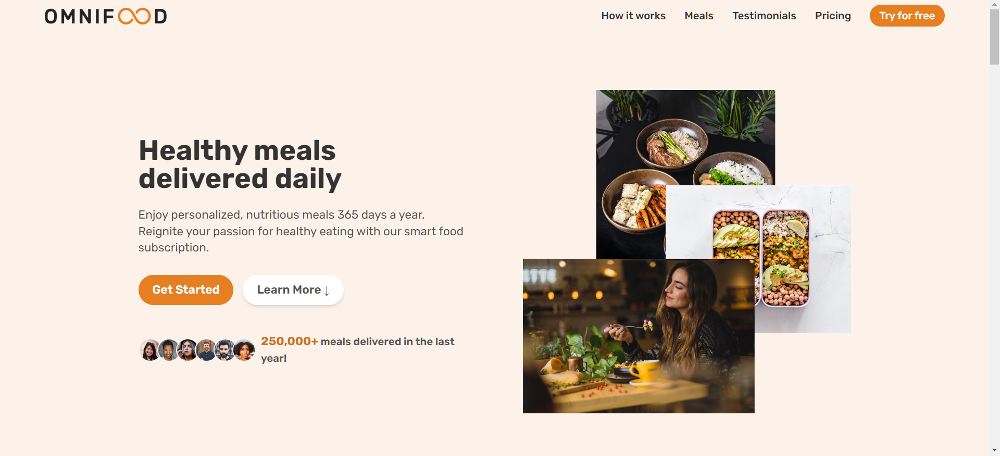

# OmniFood Project

## About Omnifood

We are a technology company first, but with a major focus on consumer well-being through a healthy diet. Most people are very busy with their jobs, family and friends, and other important activities, which doesn't leave much time for cooking. This might lead to a poor diet and lasting health consequences. We want to solve this problem by using an AI-centric approach. Users can use our app to select their diet and foods they like and dislike, and our AI algorithm will create a custom and individual weekly meal plan. But we don't stop there. We partner with restaurants and other cooking partners to actually cook and deliver all meals from the generated meal plans, in selected cities. All this will be packed up in a monthly subscription, where users can choose between receiving one or two meals per day, every single day of the month.

### Summary

The smart 365-days-per-year food subscription that will make you eat healthy again. Tailored to your personal tastes and nutritional needs. We have delivered 250,000+ meals last year!

## Introduction

OmniFood is a smart, year-round food subscription service designed to help you regain control of your health. Our service is tailored to your unique tastes and nutritional needs, ensuring that you enjoy every bite.

## Overview:



- **Live Site**: [OmniFood](https://omnifood-resturant-alx.netlify.app/)
- **Blog Article**: [Final Project Blog Article](https://your-blog-link.com)
- **Authors**: [Hussien Elfayoumy](https://www.linkedin.com/in/hussien-elfayoumy-551721270/) | [Ziad Nasser](https://www.linkedin.com/in/ziadnasser20/)

## Installation

1. Clone the repository:

```bash bash
   git clone https://github.com/hussien22elfayoumy/OmniFood-Resturant.git
```

2. Navigate to the project directory:

```bash
   cd OmniFood-Resturant
```

3. Install dependencies:

```bash
  npm install
```

4. Run the project:

```bash
  npm run dev
```

## Usage

- Visit the [OmniFood live site](https://omnifood-resturant-alx.netlify.app/) to sign up and start your personalized meal plan.

## Contributing

## Related projects

- [HelloFresh](https://www.hellofresh.com)
- [Freshly](https://www.freshly.com)

## Licensing

- This project is licensed under the MIT License.
